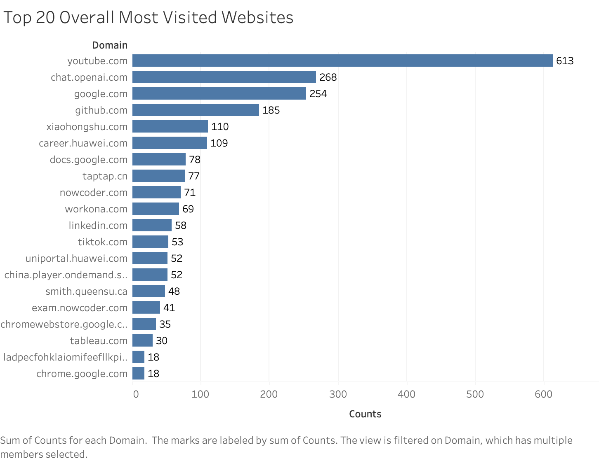
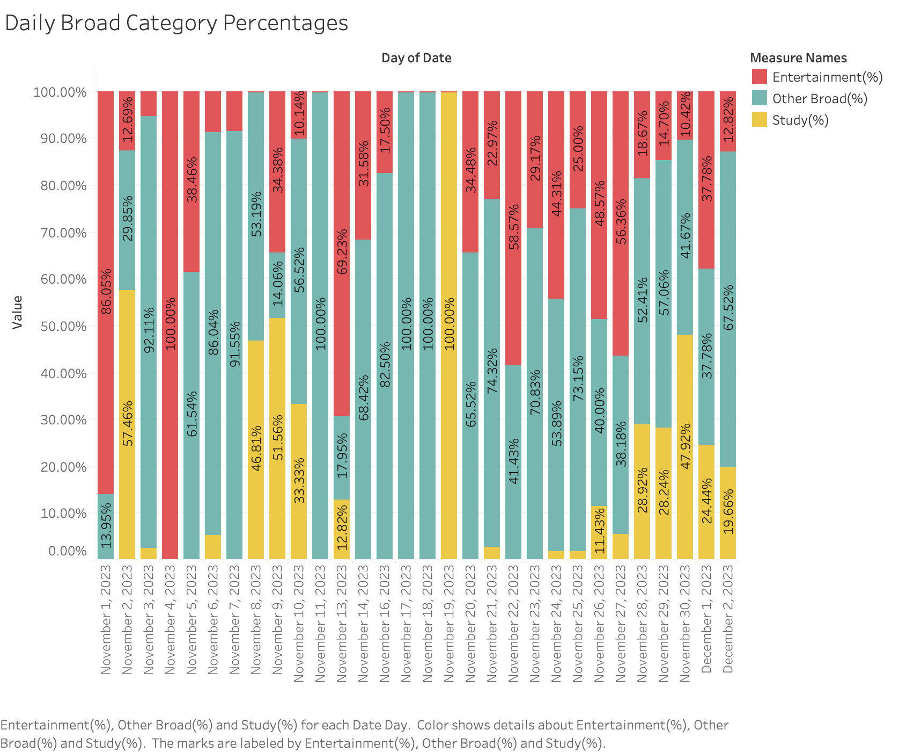
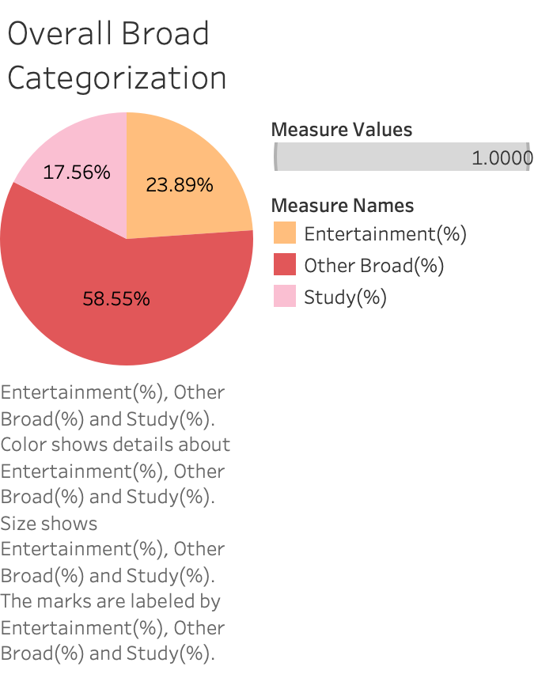
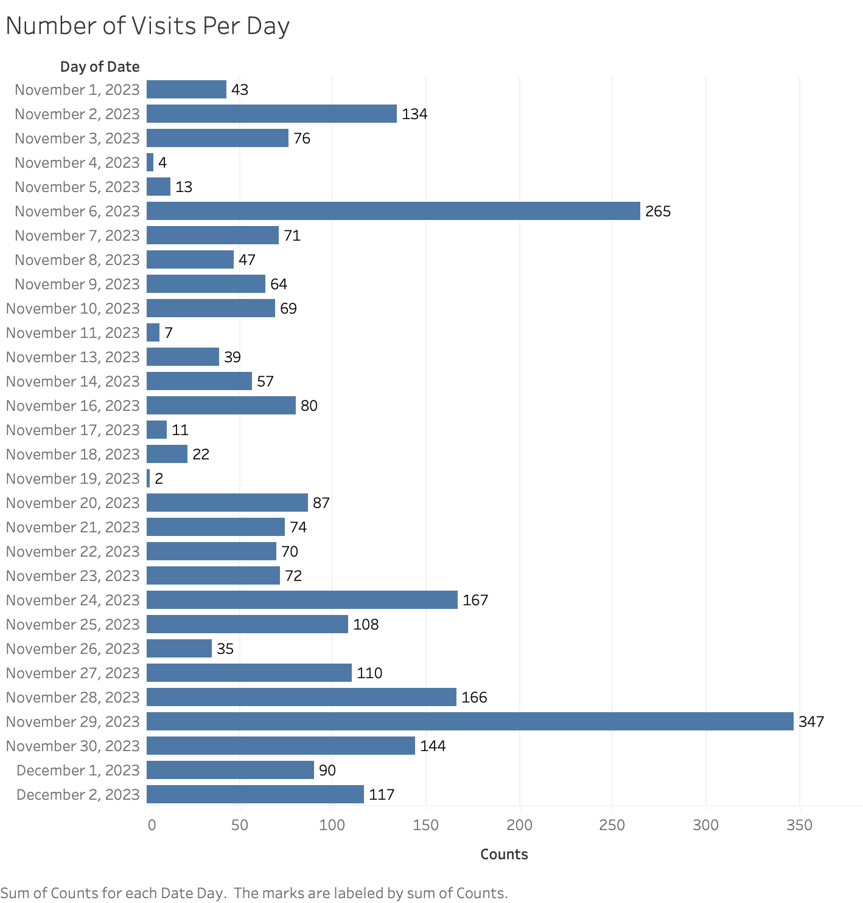
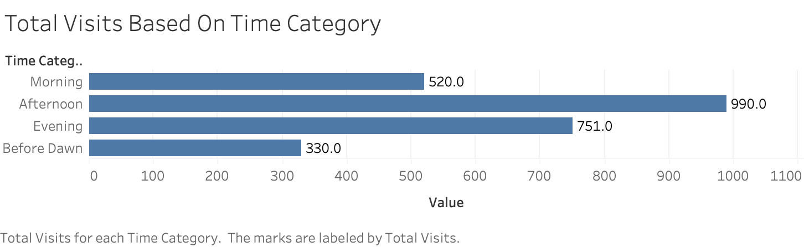
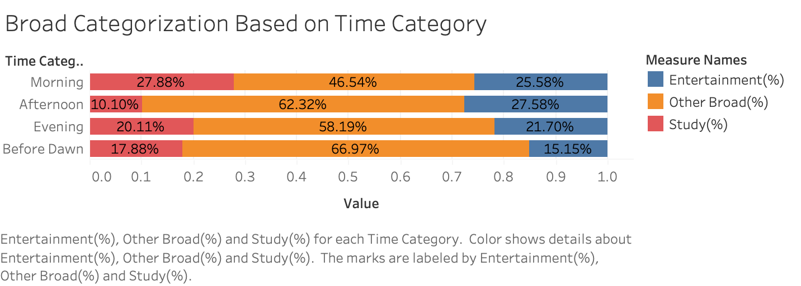
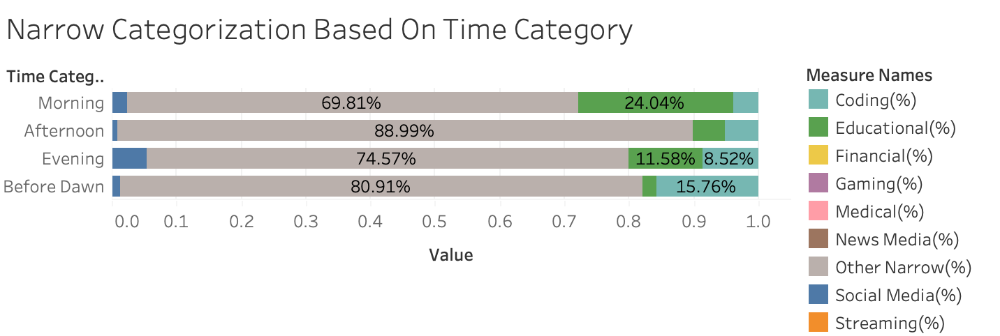

# Comprehensive User Browser History Analysis

[toc]

## Introduction

**Purpose**:

This project aims to analyze an individual's browser history to gain insights into their online behavior, preferences, and time allocation. By delving into various aspects of the user's browsing data, the project seeks to understand patterns in internet usage, with a particular focus on distinguishing between different types of online activities, such as educational, entertainment, and professional use.

In this project, we try to answer the following questions:

- What does the user’s browser history reveal about their daily and overall online behavioral patterns? How are these patterns influenced by different factors like time of day or type of website?

- How can we categorize and quantify the user's internet usage into different purposes such as entertainment, education, or work-related activities? How do these categories vary over time?

- Can we determine the intentionality of a user's website visits based on their method of accessing the website (e.g., typing the URL directly vs. clicking a link)? How does this intentionality vary across different types of websites?

  

## Background

**Why This Project is Important:**

Understanding one's browsing patterns can significantly aid in personal productivity and time management. By analyzing which websites are most frequently visited and categorizing them into productivity-related or entertainment-related, individuals can gain insights into how they allocate their online time. This awareness can lead to better time management strategies and more conscious decisions about web usage.

Furthermore, the recent global shift towards remote education and work has further intensified the need to understand online behaviors. As more people rely on the internet for learning and professional activities, it becomes important to analyze how effectively these platforms are being used.

## Data Sources

**Data Origin**: The data for the project originates from personal browser history, which is collected using the Chrome extension [Export Chrome History](https://chromewebstore.google.com/detail/export-chrome-history/dihloblpkeiddiaojbagoecedbfpifdj). This extension allows users to extract their browsing history from Google Chrome and export it in various formats for analysis.

**Data Description**: The dataset includes the following fields, as captured by the Chrome extension:

- `order`: A sequential identifier for the browsing entries.

- `id`: A unique identifier for each entry, possibly correlating to an internal database ID used by Chrome.

- `date`: The date on which the website was visited.

- `time`: The time at which the website was accessed.

- `title`: The title of the webpage as it appears in the browser tab.

- `url`: The full URL of the visited webpage.

- `visitCount`: The number of times the webpage was visited.

- `typedCount`: The number of times the URL was typed directly into the browser's address bar.

- `transition`: How the browser navigated to the URL (e.g., link click, typed, bookmarked).

  

**Data Accessibility**: Currently, the data is not publicly available as it is personal and has been extracted using a private Chrome extension. The data includes potentially sensitive information and may require anonymization before being shared or used for collaborative purposes.

**Data Collection Range**: The extension allows for the extraction of data over variable time ranges, including a day, a week, a month, or three months, giving flexibility in the period of analysis.

**Disclaimer**: While the data is sourced from personal browsing history, if similar analysis is intended for broader use, it is crucial to ensure that proper permissions and privacy considerations are taken into account. Data should be anonymized and stripped of any personally identifiable information (PII) before being used in any public or shared context.

## Technologies and Tools Used

**Programming Languages:** 

- Python 

**Python Libraries:** 

- Pandas
- re
- os
- urllib.parse: urlparse
- collections: Counter

**Tools**:

- Python: Responsible for data preprocess and analysis
- Excel: Used to store processed and analyzed data
- Tableau: Used for data visualization

## Installation and Setup

**Steps to analyze:**

1. Fork this repository
2. Download Chrome Extension [Export Chrome History](https://chromewebstore.google.com/detail/export-chrome-history/dihloblpkeiddiaojbagoecedbfpifdj)

3. Used [Export Chrome History](https://chromewebstore.google.com/detail/export-chrome-history/dihloblpkeiddiaojbagoecedbfpifdj) to generate browser history of any length you wishes to analyze
4. Move the generated `history.csv` to `Comprehensive-User-Browser-History-Analysis/data/raw`
5. Run the `analysis.py` from `Comprehensive-User-Browser-History-Analysis/src`
6. Your analyzed data will be generated in `Comprehensive-User-Browser-History-Analysis/data/processed`

## How to Run the Project

- Detailed instructions on how to run your analysis.
- Include any necessary commands or scripts.

## File and Directory Structure

- Explain the structure of your project’s directories and files.
- Describe the purpose of key folders and files for easier navigation.

## Analysis and Results

#### 1. Top 20 Overall Most Visited Websites

The graph titled "Top 20 Overall Most Visited Websites" is a horizontal bar chart that displays the top 20 websites visited by the user, ranked by the total number of visits. Each bar represents a different domain and the length of the bar indicates the count of visits to that domain.

Graph Description:

- **Horizontal Bars**: Each bar corresponds to the total number of visits on a particular domain.
- **Ranking Sequence**: The Y-axis represents domain names, specifically the top 20 visited domains in the dataset.
- **Activity Volume**: The X-axis measures the volume of visits, providing a sense of the user's top 20 domain activity levels.

Key findings from the graph:

1. **Dominant Websites**: The website 'youtube.com' has the highest number of visits by a significant margin, suggesting it is the most frequented site for the user. This is followed by 'chat.openai.com' and 'google.com', which also have a high number of visits, indicating regular usage.
2. **Popular Domains**: Domains such as 'github.com' and 'docs.google.com' suggest that the user engages with sites related to programming, software development, and document collaboration.
3. **Variety of Interests**: The presence of a diverse range of domains including social media platforms ('tiktok.com'), professional networking ('linkedin.com'), and job-related sites ('career.huawei.com'), reflects the user's varied interests and activities online.
4. **Educational and Career-Oriented Usage**: Several domains like 'exam.nowcoder.com' and 'smith.queensu.ca' indicate the user's engagement with educational resources and career-oriented platforms.
5. **Consistency Across Visits**: The distribution of visits across these top domains shows a consistency in the user's browsing habits, with several sites visited over 50 times, indicating regular engagement rather than sporadic visits.

This chart provides a clear snapshot of the user's online behavior, identifying which websites are most integral to their daily internet usage.

#### 2. Daily Broad Category Percentages

The "Daily Broad Category Percentages" chart categorizes the user's browser history into three main categories: `Entertainment`, `Study`, and `Other Broad`. The stacked bar graph visually represents the proportional distribution of these categories across each day in the dataset.

Graph Description:

- **Stacked Segments**: The bars are segmented to reflect the proportionate engagement in Study, Entertainment, or Other Broad activities on each specific day.
- **Date Axis**: The X-axis lists consecutive dates, indicating the period over which the browsing data was collected.
- **Percentage Axis**: The Y-axis shows percentages, allowing for the visualization of the relative distribution of the browsing activity across the categories.
- **Color Coding**: Each category is assigned a distinct color to easily differentiate between the types of activities within a day's browsing.

From this visualization, several insights emerge:

1. **Study as a Priority**: A significant portion of each bar is often dedicated to the `Study(%)` category, suggesting that the user's primary use of the internet is for educational or productivity-related purposes.
2. **Daily Fluctuations**: There is noticeable daily fluctuation in the proportion of time spent on `Entertainment(%)` and `Other Broad(%)` categories, indicating variability in the user's day-to-day browsing activities.
3. **Consistent Other Activities**: The `Other Broad(%)` segment is present each day, which implies that the user consistently engages in a variety of other activities beyond just study and entertainment.
4. **Notable Peaks**: Certain days show pronounced peaks in one category over others. For example, some days may have a higher proportion of `Entertainment(%)` or `Other Broad(%)`, which may correspond to specific events or personal downtime.
5. **Low Entertainment Engagement**: Overall, the `Entertainment(%)` category occupies the smallest segment on most days, suggesting that the user spends less time on entertainment-related websites compared to other activities.
6. **Further Exploration**: A fun activity for everyone is to assess the days with 100% `Entertainment` or `Study` to discern any patterns or triggers that lead to exclusive browsing history of one category, such as deadlines, holidays or weekends.

#### 3. Overall Broad Categorization

The "Overall Broad Categorization" pie chart compiles the user's entire browsing history into three main categories—`Study(%)`, `Entertainment(%)`, and `Other Broad(%)`—depicting the cumulative time spent in each category.

Graph Description:

- **Proportional Representation**: The chart uses colored segments to represent the percentage of the user's total browsing activity that falls into each category.
- **Majority Share**: The `Study(%)` category forms the majority of the chart, indicating a significant focus on educational or work-related browsing.
- **Secondary Activities**: `Entertainment(%)` and `Other Broad(%)` make up smaller portions of the chart, illustrating the user's time spent on leisure and other miscellaneous activities.

Insights from the Graph:

1. **Study Dominance**: With `Study(%)` accounting for 58.55% of the browsing activity, it's clear that the user's primary online engagement is with educational or productivity-related content.
2. **Considerable Entertainment Usage**: The `Entertainment(%)` category, at 23.89%, reflects a substantial engagement with entertainment websites, which is significant but not predominant.
3. **Miscellaneous Interactions**: `Other Broad(%)` holds 17.56%, suggesting that the user also explores a variety of websites that don't fall strictly into the study or entertainment classifications.

Comparative Note with "Daily Broad Category Percentages":

- When compared to the "Daily Broad Category Percentages" graph, this pie chart provides a holistic view of the user's browsing behavior over an extended period, likely revealing more consistent long-term trends as opposed to the daily fluctuations seen in the bar graph.
- The daily chart may show certain days where one category spikes, due to specific events or activities, but the overall chart averages these out to present a general pattern of internet usage.
- The pie chart's aggregation of data across a broader timeframe smoothens out daily anomalies and presents a clear picture of the user's general browsing priorities.

This overall categorization helps in understanding the user's typical internet usage patterns, offering a snapshot of their priorities over the observed period. It complements the daily distribution chart by providing a macro-level perspective on the user's browsing habits.

#### 4. Number of Visits Per Day

The chart "Number of Visits Per Day" illustrates a user's web browsing activity over a period, quantified by the number of site visits each day. The horizontal bars represent the total count of website visits per day, laid out on a calendar timeline.

Graph Description:

- **Horizontal Bars**: Each bar corresponds to the total number of visits on a particular day.
- **Activity Volume**: The X-axis measures the volume of visits, providing a sense of the user's daily internet activity levels.
- **Time Sequence**: The Y-axis represents time, specifically the days in November and early December 2023.

Insights from the Graph:

1. **Fluctuating Activity**: There's a noticeable fluctuation in daily browsing activity. Some days exhibit high numbers of site visits, while others show significantly fewer visits.
2. **Peaks of Activity**: Certain days, such as November 6, November 24, November 28, and November 29, have particularly high activity, which could correspond to specific personal or professional needs that required more extensive internet use.
3. **Periods of Low Activity**: There are also instances of minimal activity, for instance, on November 4, November 11, and November 19. These could represent days when the user was less active online or potentially did not have access to the internet.
4. **Trending Increase**: Towards the end of the month, there is a trend of increasing activity, peaking on November 29. This pattern might correlate with end-of-the-month routines or deadlines.
5. **Consistency**: Despite fluctuations, the user consistently engages with the internet on a daily basis, indicating that web browsing is a regular part of their daily routine.

#### 5. Overall Narrow Categorization

The "Overall Narrow Categorization" bar chart provides a detailed breakdown of the user's internet browsing across specific categories within a set period. This visualization enables a more granular view of the user's online activities.

Graph Description:

- **Categories**: Each horizontal bar represents a distinct category, such as `Educational`, `Coding`, `Social Media`, and others, showing a more detailed classification of the user's browsing data.
- **Proportionality**: The length of each bar correlates to the percentage of total visits that fall within each category, giving a visual representation of how much time was spent in each area.
- **Major Category**: The `Other Narrow(%)` category comprises the majority of the user's browsing activity, suggesting that most of their web usage does not fall into the predefined categories but rather into a broad range of other activities.

Insights from the Graph:

1. **Focus on Education**: With `Educational(%)` constituting 10.34% of the browsing, it's clear that a significant portion of the user's internet use is dedicated to educational content.
2. **Interest in Coding**: The `Coding(%)` category has a notable representation at 7.22%, indicating that activities related to programming or development are a substantial part of the user's online time.
3. **Social Media Engagement**: `Social Media(%)` accounts for 2.51% of the browsing history, reflecting the user's moderate use of social media platforms compared to other activities.
4. **Limited Variety in Other Segments**: Several categories such as `Streaming`, `News Media`, `Medical`, `Gaming`, and `Financial` show no recorded activity, which could imply a lack of interest or a need for better categorization if the user did engage in these activities but they were not captured by the data.
5. **Dominance of 'Other Narrow' Activities**: The overwhelming majority of the user's browsing falls into the `Other Narrow(%)` category at 79.93%, which includes any activity not classified in the specified narrow categories. This indicates diverse internet usage that may require further categorization to fully understand the user's browsing preferences and behavior.

#### 6. Total Visits Based On Time Category

The "Total Visits Based On Time Category" bar chart displays the aggregate of the user's website visits segmented by different times of the day. This visualization allows for an analysis of the user's online activity patterns relative to the time of day.

Graph Description:

- **Categories**: Each horizontal bar represents a time category—Morning, Afternoon, Evening, and Before Dawn—offering insight into when the user is most active online.
- **Proportionality**: The length of each bar corresponds to the total number of visits within each time category, visually indicating the user's internet activity volume during different times of the day.
- **Major Category**: The Afternoon category shows the highest number of visits, suggesting that this is the period of peak activity for the user.

Insights from the Graph:

1. **Afternoon Activity**: With 990 visits, the Afternoon category sees the highest internet use, which could correspond to the user's personal schedule or work-related activity peaks.
2. **Evening Consistency**: The Evening period also sees substantial activity with 751 visits, indicating sustained internet use during these hours, possibly for relaxation or post-work activities.
3. **Morning Engagement**: The Morning category shows moderate activity with 520 visits, which may align with the start of the user's day or routine morning tasks.
4. **Before Dawn Usage**: There is a notable amount of activity (330 visits) categorized as Before Dawn, which might indicate late-night browsing or activities that occur in the very early hours of the day.
5. **Dominance of Daytime Activity**: The significant activity during the Afternoon and Evening hours in contrast to Morning and Before Dawn suggests the user's browsing aligns with typical daytime and early evening periods, which may reflect a standard workday or personal habit pattern.

This chart provides a clear depiction of the user's preferred browsing times, which could be valuable for targeting specific content delivery times or understanding the user's daily routine and lifestyle.

#### 7. Broad Categorization Based on Time Category

The "Broad Categorization Based on Time Category" chart is a stacked bar graph illustrating the distribution of the user's web browsing across three broad categories—`Study(%)`, `Other Broad(%)`, and `Entertainment(%)`—segmented by different times of the day: Morning, Afternoon, Evening, and Before Dawn.

Graph Description:

- **Categories**: Each horizontal bar is divided into segments that represent the proportion of the user's browsing activity within the categories of Study, Other Broad, and Entertainment for each time category.
- **Proportionality**: The length of each segment within the bars correlates to the percentage of total visits attributed to each category, providing a visual comparison of how the user's browsing preferences vary by the time of day.
- **Time of Day**: The bars are grouped by the time of day, indicating when the user is most active in each of the browsing categories.

Insights from the Graph:

1. **Study Focus**: A significant segment of the browsing activity across all times of day is dedicated to Study, which is especially pronounced during the Morning period.
2. **Afternoon Entertainment**: In the Afternoon, there is a visible increase in Entertainment-related browsing, suggesting this might be the user's preferred time for leisure activities online.
3. **Evening Diversification**: During the Evening, there's a more balanced distribution between Study and Other Broad activities, indicating the user's engagement in a variety of activities.
4. **Before Dawn**: The Before Dawn period shows a lower overall browsing activity, but it still includes a mix of Study and Other Broad, with Study being slightly more predominant.
5. **Overall Trends**: While Study is a constant throughout all times of the day, the user's engagement with Entertainment and Other Broad categories suggests a transition from work or study-oriented activities to more leisure and varied browsing as the day progresses.

This chart offers insights into the user's daily rhythm and preferences, showing how their focus shifts across different types of online content from morning to night.

#### 8. Narrow Categorization Based On Time Category

The "Narrow Categorization Based on Time Category" chart is a stacked bar graph that displays the user's website visits broken down into specific categories within narrower interests, distributed across different times of the day: Morning, Afternoon, Evening, and Before Dawn.

Graph Description:

- **Categories**: Each horizontal bar represents a time category, segmented into narrower interests like `Coding(%)`, `Educational(%)`, `Social Media(%)`, and others, providing a detailed insight into the user's specific browsing activities during these periods.
- **Proportionality**: The segments within each bar show the relative proportion of visits to websites within each narrow category, relative to the time of day.
- **Time of Day**: The bars are ordered by the time of day, highlighting when certain activities are more prevalent.

Insights from the Graph:

1. **Educational Focus**: There is a significant emphasis on `Educational(%)` content during the Morning and Afternoon, which could indicate dedicated times for learning or professional development.
2. **Evening Diversification**: In the Evening, while `Educational(%)` content still has a presence, there's also a noticeable portion of browsing in the `Other Narrow(%)` category, suggesting a variety of activities that may include reading news, online shopping, or other interests.
3. **Before Dawn Engagement**: During the Before Dawn period, `Other Narrow(%)` activities dominate, which may include a range of miscellaneous activities or late-night browsing habits.
4. **Social Media and Coding**: `Social Media(%)` and `Coding(%)` have consistent yet smaller segments throughout the day, with an uptick in social media in the Evening and Before Dawn hours.
5. **Low Activity in Other Interests**: Categories like `Financial(%)`, `Gaming(%)`, `Medical(%)`, `News Media(%)`, and `Streaming(%)` show little to no activity, which could indicate lesser interest or that these activities occur less frequently within the user's online routine.

This chart offers a detailed perspective on the user's daily internet use, showing not only the volume of activity but also how the user's focus shifts among various interests at different times of the day.

## Challenges and Learnings

- Mention any challenges faced during the project and how you addressed them.
- Share any significant learnings or surprises from the project.

Fraudulent data

Redudant code

Better data structure

## Future Work

- Discuss potential extensions or future directions for the project.

  

## Contact Information or Credits

- Provide your contact information or acknowledge contributions from others.

**References**:

- Chrome Web Store - Export Chrome History Extension: [Export Chrome History](https://chromewebstore.google.com/detail/export-chrome-history/dihloblpkeiddiaojbagoecedbfpifdj)

## License 

- Specify the license under which the project is released, if applicable.
