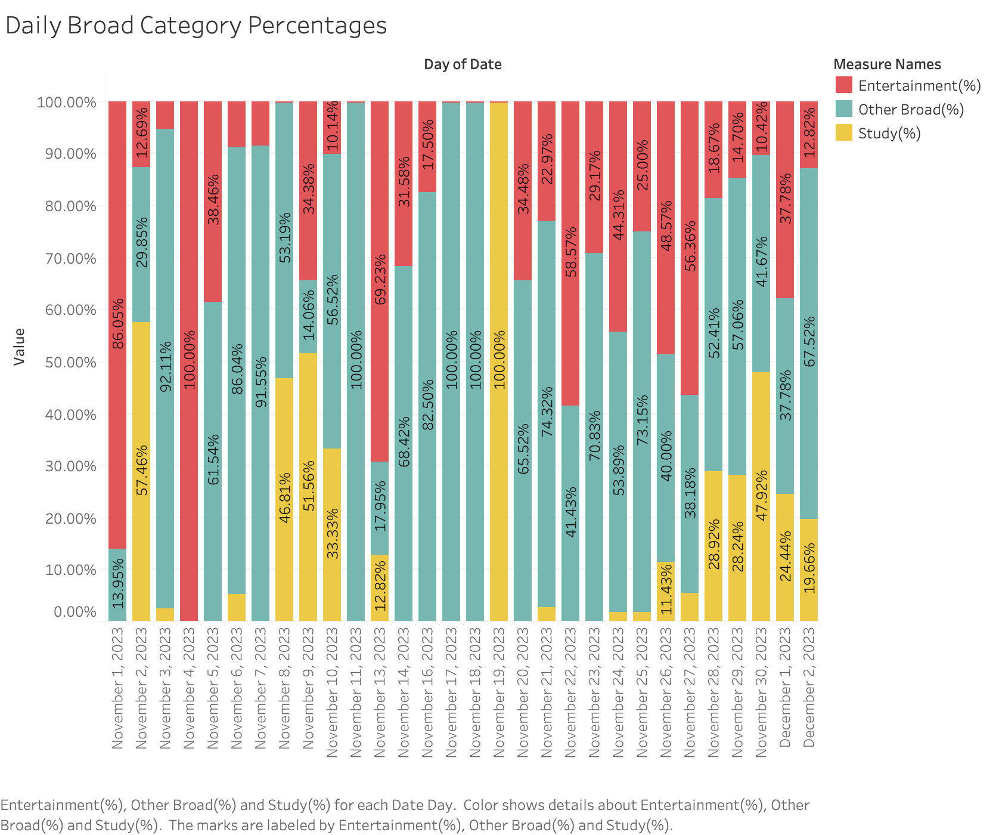
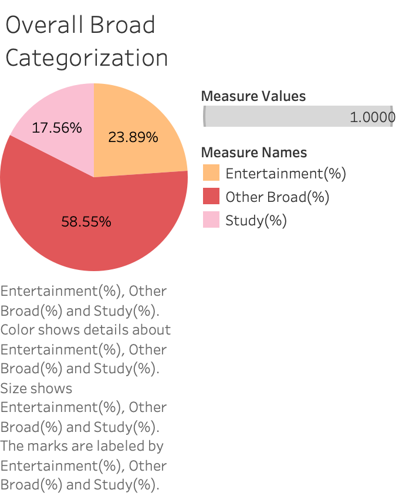
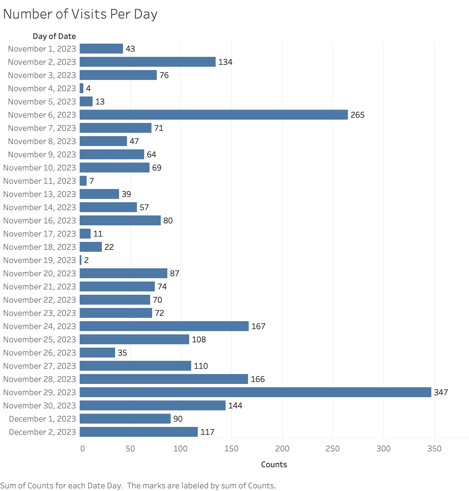

# Comprehensive User Browser History Analysis

## Introduction

**Purpose**:

This project aims to analyze an individual's browser history to gain insights into their online behavior, preferences, and time allocation. By delving into various aspects of the user's browsing data, the project seeks to understand patterns in internet usage, with a particular focus on distinguishing between different types of online activities, such as educational, entertainment, and professional use.

In this project, we try to answer the following questions:

- What does the user’s browser history reveal about their daily and overall online behavioral patterns? How are these patterns influenced by different factors like time of day or type of website?

- How can we categorize and quantify the user's internet usage into different purposes such as entertainment, education, or work-related activities? How do these categories vary over time?

- Can we determine the intentionality of a user's website visits based on their method of accessing the website (e.g., typing the URL directly vs. clicking a link)? How does this intentionality vary across different types of websites?

  

## Background

**Why This Project is Important:**

Understanding one's browsing patterns can significantly aid in personal productivity and time management. By analyzing which websites are most frequently visited and categorizing them into productivity-related or entertainment-related, individuals can gain insights into how they allocate their online time. This awareness can lead to better time management strategies and more conscious decisions about web usage.

Furthermore, the recent global shift towards remote education and work has further intensified the need to understand online behaviors. As more people rely on the internet for learning and professional activities, it becomes important to analyze how effectively these platforms are being used.

## Data Sources

**Data Origin**: The data for the project originates from personal browser history, which is collected using the Chrome extension [Export Chrome History](https://chromewebstore.google.com/detail/export-chrome-history/dihloblpkeiddiaojbagoecedbfpifdj). This extension allows users to extract their browsing history from Google Chrome and export it in various formats for analysis.

**Data Description**: The dataset includes the following fields, as captured by the Chrome extension:

- `order`: A sequential identifier for the browsing entries.

- `id`: A unique identifier for each entry, possibly correlating to an internal database ID used by Chrome.

- `date`: The date on which the website was visited.

- `time`: The time at which the website was accessed.

- `title`: The title of the webpage as it appears in the browser tab.

- `url`: The full URL of the visited webpage.

- `visitCount`: The number of times the webpage was visited.

- `typedCount`: The number of times the URL was typed directly into the browser's address bar.

- `transition`: How the browser navigated to the URL (e.g., link click, typed, bookmarked).

  

**Data Accessibility**: Currently, the data is not publicly available as it is personal and has been extracted using a private Chrome extension. The data includes potentially sensitive information and may require anonymization before being shared or used for collaborative purposes.

**Data Collection Range**: The extension allows for the extraction of data over variable time ranges, including a day, a week, a month, or three months, giving flexibility in the period of analysis.

**Disclaimer**: While the data is sourced from personal browsing history, if similar analysis is intended for broader use, it is crucial to ensure that proper permissions and privacy considerations are taken into account. Data should be anonymized and stripped of any personally identifiable information (PII) before being used in any public or shared context.

## Technologies and Tools Used

**Programming Languages:** 

- Python 

**Python Libraries:** 

- Pandas
- re
- os
- urllib.parse: urlparse
- collections: Counter

**Tools**:

- Python: Responsible for data preprocess and analysis
- Excel: Used to store processed and analyzed data
- Tableau: Used for data visualization

## Installation and Setup

**Steps to analyze:**

1. Fork this repository
2. Download Chrome Extension [Export Chrome History](https://chromewebstore.google.com/detail/export-chrome-history/dihloblpkeiddiaojbagoecedbfpifdj)

3. Used [Export Chrome History](https://chromewebstore.google.com/detail/export-chrome-history/dihloblpkeiddiaojbagoecedbfpifdj) to generate browser history of any length you wishes to analyze
4. Move the generated `history.csv` to `Comprehensive-User-Browser-History-Analysis/data/raw`
5. Run the `analysis.py` from `Comprehensive-User-Browser-History-Analysis/src`
6. Your analyzed data will be generated in `Comprehensive-User-Browser-History-Analysis/data/processed`

## How to Run the Project

- Detailed instructions on how to run your analysis.
- Include any necessary commands or scripts.

## File and Directory Structure

- Explain the structure of your project’s directories and files.
- Describe the purpose of key folders and files for easier navigation.

## Analysis and Results

The chart "Number of Visits Per Day" illustrates a user's web browsing activity over a period, quantified by the number of site visits each day. The horizontal bars represent the total count of website visits per day, laid out on a calendar timeline.

Graph Description:

- **Horizontal Bars**: Each bar corresponds to the total number of visits on a particular day.
- **Time Sequence**: The X-axis represents time, specifically the days in November and early December 2023.
- **Activity Volume**: The Y-axis measures the volume of visits, providing a sense of the user's daily internet activity levels.

Insights from the Graph:

1. **Fluctuating Activity**: There's a noticeable fluctuation in daily browsing activity. Some days exhibit high numbers of site visits, while others show significantly fewer visits.
2. **Peaks of Activity**: Certain days, such as November 6, November 24, November 28, and November 29, have particularly high activity, which could correspond to specific personal or professional needs that required more extensive internet use.
3. **Periods of Low Activity**: There are also instances of minimal activity, for instance, on November 4, November 11, and November 19. These could represent days when the user was less active online or potentially did not have access to the internet.
4. **Trending Increase**: Towards the end of the month, there is a trend of increasing activity, peaking on November 29. This pattern might correlate with end-of-the-month routines or deadlines.
5. **Consistency**: Despite fluctuations, the user consistently engages with the internet on a daily basis, indicating that web browsing is a regular part of their daily routine.

By examining the number of visits each day, stakeholders can gain valuable insights into the user's online behavior, including peak usage times that could inform personalized content delivery or targeted online services.

The "Daily Broad Category Percentages" chart categorizes the user's browser history into three main categories: `Entertainment`, `Study`, and `Other Broad`. The stacked bar graph visually represents the proportional distribution of these categories across each day in the dataset.

Graph Description:

- **Stacked Segments**: The bars are segmented to reflect the proportionate engagement in Study, Entertainment, or Other Broad activities on each specific day.
- **Date Axis**: The X-axis lists consecutive dates, indicating the period over which the browsing data was collected.
- **Percentage Axis**: The Y-axis shows percentages, allowing for the visualization of the relative distribution of the browsing activity across the categories.
- **Color Coding**: Each category is assigned a distinct color to easily differentiate between the types of activities within a day's browsing.

From this visualization, several insights emerge:

1. **Study as a Priority**: A significant portion of each bar is often dedicated to the `Study(%)` category, suggesting that the user's primary use of the internet is for educational or productivity-related purposes.
2. **Daily Fluctuations**: There is noticeable daily fluctuation in the proportion of time spent on `Entertainment(%)` and `Other Broad(%)` categories, indicating variability in the user's day-to-day browsing activities.
3. **Consistent Other Activities**: The `Other Broad(%)` segment is present each day, which implies that the user consistently engages in a variety of other activities beyond just study and entertainment.
4. **Notable Peaks**: Certain days show pronounced peaks in one category over others. For example, some days may have a higher proportion of `Entertainment(%)` or `Other Broad(%)`, which may correspond to specific events or personal downtime.
5. **Low Entertainment Engagement**: Overall, the `Entertainment(%)` category occupies the smallest segment on most days, suggesting that the user spends less time on entertainment-related websites compared to other activities.
6. **Further Exploration**: A fun activity for everyone is to assess the days with 100% `Entertainment` or `Study` to discern any patterns or triggers that lead to exclusive browsing history of one category, such as deadlines, holidays or weekends.

The "Overall Broad Categorization" pie chart compiles the user's entire browsing history into three main categories—`Study(%)`, `Entertainment(%)`, and `Other Broad(%)`—depicting the cumulative time spent in each category.

Graph Description:

- **Proportional Representation**: The chart uses colored segments to represent the percentage of the user's total browsing activity that falls into each category.
- **Majority Share**: The `Study(%)` category forms the majority of the chart, indicating a significant focus on educational or work-related browsing.
- **Secondary Activities**: `Entertainment(%)` and `Other Broad(%)` make up smaller portions of the chart, illustrating the user's time spent on leisure and other miscellaneous activities.

Insights from the Graph:

1. **Study Dominance**: With `Study(%)` accounting for 58.55% of the browsing activity, it's clear that the user's primary online engagement is with educational or productivity-related content.
2. **Considerable Entertainment Usage**: The `Entertainment(%)` category, at 23.89%, reflects a substantial engagement with entertainment websites, which is significant but not predominant.
3. **Miscellaneous Interactions**: `Other Broad(%)` holds 17.56%, suggesting that the user also explores a variety of websites that don't fall strictly into the study or entertainment classifications.

Comparative Note with "Daily Broad Category Percentages":

- When compared to the "Daily Broad Category Percentages" graph, this pie chart provides a holistic view of the user's browsing behavior over an extended period, likely revealing more consistent long-term trends as opposed to the daily fluctuations seen in the bar graph.
- The daily chart may show certain days where one category spikes, due to specific events or activities, but the overall chart averages these out to present a general pattern of internet usage.
- The pie chart's aggregation of data across a broader timeframe smoothens out daily anomalies and presents a clear picture of the user's general browsing priorities.

This overall categorization helps in understanding the user's typical internet usage patterns, offering a snapshot of their priorities over the observed period. It complements the daily distribution chart by providing a macro-level perspective on the user's browsing habits.

The chart "Number of Visits Per Day" illustrates a user's web browsing activity over a period, quantified by the number of site visits each day. The horizontal bars represent the total count of website visits per day, laid out on a calendar timeline.

Graph Description:

- **Horizontal Bars**: Each bar corresponds to the total number of visits on a particular day.
- **Time Sequence**: The X-axis represents time, specifically the days in November and early December 2023.
- **Activity Volume**: The Y-axis measures the volume of visits, providing a sense of the user's daily internet activity levels.

Insights from the Graph:

1. **Fluctuating Activity**: There's a noticeable fluctuation in daily browsing activity. Some days exhibit high numbers of site visits, while others show significantly fewer visits.
2. **Peaks of Activity**: Certain days, such as November 6, November 24, November 28, and November 29, have particularly high activity, which could correspond to specific personal or professional needs that required more extensive internet use.
3. **Periods of Low Activity**: There are also instances of minimal activity, for instance, on November 4, November 11, and November 19. These could represent days when the user was less active online or potentially did not have access to the internet.
4. **Trending Increase**: Towards the end of the month, there is a trend of increasing activity, peaking on November 29. This pattern might correlate with end-of-the-month routines or deadlines.
5. **Consistency**: Despite fluctuations, the user consistently engages with the internet on a daily basis, indicating that web browsing is a regular part of their daily routine.

The "Overall Narrow Categorization" bar chart provides a detailed breakdown of the user's internet browsing across specific categories within a set period. This visualization enables a more granular view of the user's online activities.

Graph Description:

- **Categories**: Each horizontal bar represents a distinct category, such as `Educational`, `Coding`, `Social Media`, and others, showing a more detailed classification of the user's browsing data.
- **Proportionality**: The length of each bar correlates to the percentage of total visits that fall within each category, giving a visual representation of how much time was spent in each area.
- **Major Category**: The `Other Narrow(%)` category comprises the majority of the user's browsing activity, suggesting that most of their web usage does not fall into the predefined categories but rather into a broad range of other activities.

Insights from the Graph:

1. **Focus on Education**: With `Educational(%)` constituting 10.34% of the browsing, it's clear that a significant portion of the user's internet use is dedicated to educational content.
2. **Interest in Coding**: The `Coding(%)` category has a notable representation at 7.22%, indicating that activities related to programming or development are a substantial part of the user's online time.
3. **Social Media Engagement**: `Social Media(%)` accounts for 2.51% of the browsing history, reflecting the user's moderate use of social media platforms compared to other activities.
4. **Limited Variety in Other Segments**: Several categories such as `Streaming`, `News Media`, `Medical`, `Gaming`, and `Financial` show no recorded activity, which could imply a lack of interest or a need for better categorization if the user did engage in these activities but they were not captured by the data.
5. **Dominance of 'Other Narrow' Activities**: The overwhelming majority of the user's browsing falls into the `Other Narrow(%)` category at 79.93%, which includes any activity not classified in the specified narrow categories. This indicates diverse internet usage that may require further categorization to fully understand the user's browsing preferences and behavior.

## Challenges and Learnings

- Mention any challenges faced during the project and how you addressed them.
- Share any significant learnings or surprises from the project.

Fraudulent data

## Future Work

- Discuss potential extensions or future directions for the project.

  

## Contact Information or Credits

- Provide your contact information or acknowledge contributions from others.

**References**:

- Chrome Web Store - Export Chrome History Extension: [Export Chrome History](https://chromewebstore.google.com/detail/export-chrome-history/dihloblpkeiddiaojbagoecedbfpifdj)

## License 

- Specify the license under which the project is released, if applicable.
